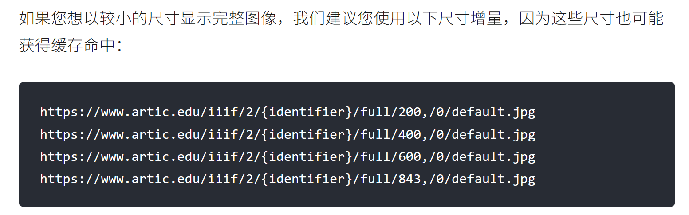

# React + TypeScript Mini Project

## 要求

创建一个芝加哥艺术博物馆藏品探索应用程序。目标是创建一个工具，用于搜索芝加哥艺术博物馆的藏品，将喜欢的艺术品保存到个人画廊，并添加备注.

使用第三方API [Art Institue of Chicago API](https://api.artic.edu/docs/) 

## 步骤

### Setups

```bash
npm create vite@latest 
npm i zod tailwindcss @tailwindcss/vite daisyui
```

### 安装整理

删除不需要的文件及文件夹

配置tailwindcss和daisyui

``` ts
// vite.config.ts
import { defineConfig } from 'vite'
import tailwindcss from '@tailwindcss/vite'

export default defineConfig({
  plugins: [
    tailwindcss(),
  ],
})
```

```css
@import "tailwindcss";
@plugin "daisyui";
```

## 结构

### `search`

 搜索完成后可以显示结果, 以卡片的形式或者列表形式, 需要有一个收藏按钮,可以显示是否已收藏, 点击可以toogle, 

Implement a helper that queries the AIC **search** endpoint : https://api.artic.edu/api/v1/artworks/search?q=

 POST 'https://api.artic.edu/api/v1/artworks/search' \


### `Gallery`

 显示的是收藏的艺术品, grid

### `ArtworkCard ` 

 显示: image, title, artist,  其余组件 favorited(boolean), note(string) 可添加编辑, 需要用zod

image url 组成:https://www.artic.edu/iiif/2/{identifier}/{region}/{size}/{rotation}/{quality}.{format} 
 https://www.artic.edu/iiif/2/{data.image_id}/full/843,/0/default.jpg



card 需要调整到一个大小


